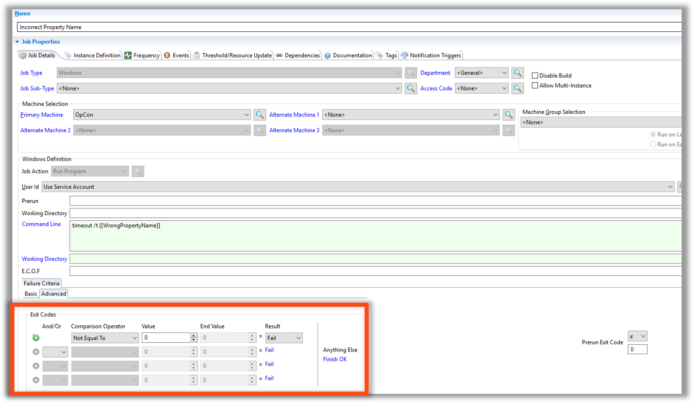
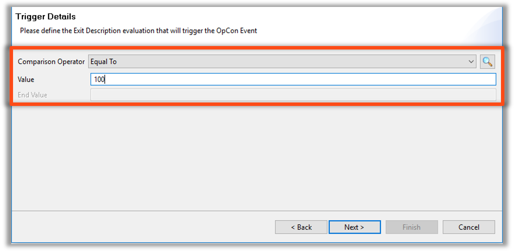

### Advanced Failure Criteria

### Job Output Parsing - Purpose

* Advanced Failure Criteria allows for customizable Exit Code Conditions
    * Failures are still based on Exit Code

* Job Output Parsing
    * Prompts OpCon to scan the **Job Output** upon completion and change an Exit Code to a specified **Exit Code** if the specified String is found anywhere in the **Job Output**  
    * Allows Jobs to scan third party log files for specified Strings

### Advanced Failure Criteria   

* Switch Results to **Finished OK**
* Switch Comparison Operator to **Equal To**
* Add a line using **OR** option
* Enter Exit Codes to be considered **Finished OK**


### Advanced Failure Criteria - Events

* Events can be sent based on the Exit Code received


* Each Operating System has rules for Exit Description Names
    * Unix - Use **Contains** unless the Full Exit Code is spelled out
    * Windows - Use the final number
        * ```100``` instead of ```000000000100```


### Enterprise Manager

<details>


#### Job Output Parsing - Purpose

* Advanced Failure Criteria allows for customizable Exit Code Conditions
    * Failures are still based on Exit Code

* Job Output Parsing
    * Prompts OpCon to scan the **Job Output** upon completion and change an Exit Code to a specified **Exit Code** if the specified String is found anywhere in the **Job Output**  
    * Allows Jobs to scan third party log files for specified Strings

#### Advanced Failure Criteria



* Switch Results to **Finished OK**
* Switch Comparison Operator to **Equal To**
* Add a line using **OR** option
* Enter Exit Codes to be considered **Finished OK**


#### Advanced Failure Criteria - Events

* Events can be sent based on the Exit Code received


* Each Operating System has rules for Exit Description Names
    * Unix - Use **Contains** unless the Full Exit Code is spelled out
    * Windows - Use the final number
        * ```100``` instead of ```000000000100```  



</details>