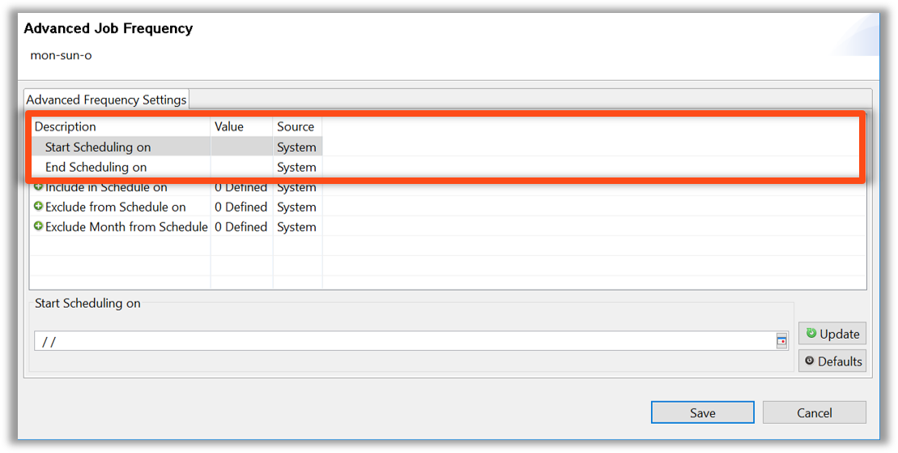
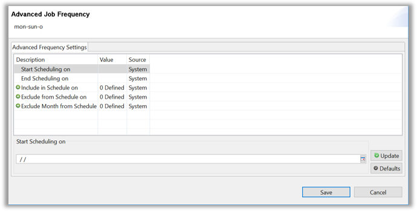

<head>
  <meta name="robots" content="noindex, nofollow" />
</head>

### Advanced Frequencies

* OpCon Frequencies are very powerful
* The **Advanced** Tab under Frequency List allows addition to or removal from the selected Job Frequency functions
    * Advanced Tab settings are not saved with the Frequency for reuse
    * These settings are saved with the Job
        * Example: Job Start Offset, Build Status, etc.

  

* There are several options in Advanced Frequency settings:

**Start Scheduling On** – Allows Job creation in preparation of a large change (such as changing vendors)
- Directs the allocated Frequency or Frequencies not to start until a specified date

**End Scheduling On** – Essentially the exact opposite of Start **Scheduling On**

**Include in Schedule On** – Allows variously selected On-Off Dates for a Job to be Scheduled  

**Excluded from Schedule On** – Essentially the exact opposite of **Include in Schedule On**  

**Exclude Month from Schedule** – Used often on Quarterly Jobs which do not run on the first month of quarter

### Enterprise Manager

* OpCon Frequencies are very powerful
* The **Advanced** Tab under Frequency List allows addition to or removal from the selected Job Frequency functions
    * Advanced Tab settings are not saved with the Frequency for reuse
    * These settings are saved with the Job
        * Example: Job Start Offset, Build Status, etc.

* There are several options in Advanced Frequency settings:

* **Start Scheduling On** – Allows Job creation in preparation of a large change (such as changing vendors)
    - Directs the allocated Frequency or Frequencies not to start until a specified date

* **End Scheduling On** – Essentially the exact opposite of Start **Scheduling On**

**Include in Schedule On** – Allows variously selected On-Off Dates for a Job to be Scheduled 

**Excluded from Schedule On** – Essentially the exact opposite of **Include in Schedule On**  

**Exclude Month from Schedule** – Used often on Quarterly Jobs which do not run on the first month of quarter

