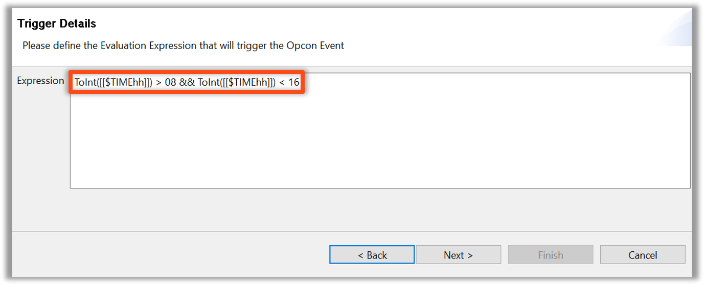
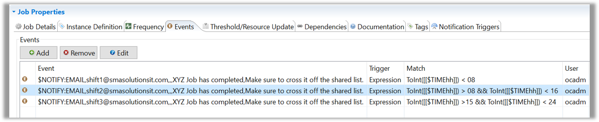
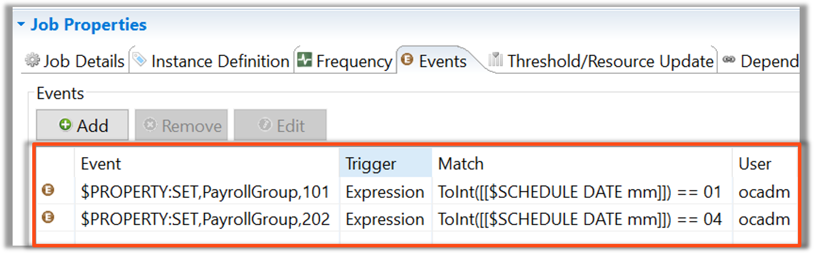

<head>
  <meta name="robots" content="noindex, nofollow" />
</head>

### Expression Based Events

If an Expression is true when a Job completes, an Event will trigger

#### Example:

Set different Alerts based on Time

* Email **Shift 1** if the Job competes before **8:00 am**  
* Email **Shift 2** if the Job completes between **8:00 am** and **4:00 pm**  
* Email **Shift 3** if the Job completes between **4:00 pm** and **12:00 am (midnight)**  

Set different Parameters based on Month  

* Jan, Apr, Jul, Oct = **101**  
* Feb, May, Aug, Nov = **250**  
* Mar, Jun, Sep, Dec = **134**  

#### Example 

Time Windows

  

#### Example:

Monthly Value Expressions 

### Enterprise Manager

#### Expression Based Events

If an Expression is true when a Job completes, an Event will trigger

#### Example:

Set different Alerts based on Time

* Email **Shift 1** if the Job competes before **8:00 am**  
* Email **Shift 2** if the Job completes between **8:00 am** and **4:00 pm**  
* Email **Shift 3** if the Job completes between **4:00 pm** and **12:00 am (midnight)**  

Set different Parameters based on Month  

* Jan, Apr, Jul, Oct = **101**  
* Feb, May, Aug, Nov = **250**  
* Mar, Jun, Sep, Dec = **134**  

#### Example 

Time Windows

#### Example:

Monthly Value Expressions 

