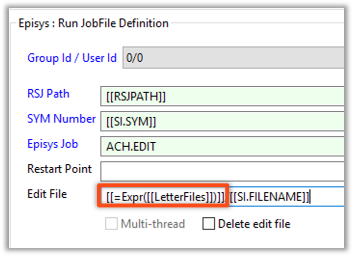

<head>
  <meta name="robots" content="noindex, nofollow" />
</head>

# Property Expressions - Expr

## Overview

The Expr Expression provide is used to evaluate another expression

## Syntax

Expr(value)

* **value:** is another expression made up of strings or property names **OR** an expression that evaluates a string value.

## Usage

* It provides the ability to place a Property within the Value of another Property
  * Use the ```Expr``` function: ```[[=Expr([[PropertyName]])]]```

:::tip Example

* Useful when you have a path and part of that path can change. Here we have a Property with multiple parts that when resolved will resolve as
  * /SYM/SYM000/REPORT
* We would define the following
  * **Schedule Instance Property:** SYM = ```000```
  * **Global Property:** PATH_Report = ```"/SYM/SYM" + [[SI.SYM]] + "/" + "REPORT”```


* When used in a job, we would reference the Global Property
  * [[=Expr(PATH_Report)]]

:::

:::note 

* Starting or ending string with ```\``` on Windows Path throws the Expression off

:::

## Enterprise Manager

<details>

Expressions provide the ability to place a Property within the Value of another Property (embedding a Property within Property)

Use the ```Expr``` function: ```[[=Expr([[PropertyName]])]]```

Add strings together
 
PropertyName = ```"/SYM/SYM" + [[SI.SYM]] + "/" + "REPORT”```




* Starting or ending string with ```\``` on Windows Path throws the Expression off

</details>