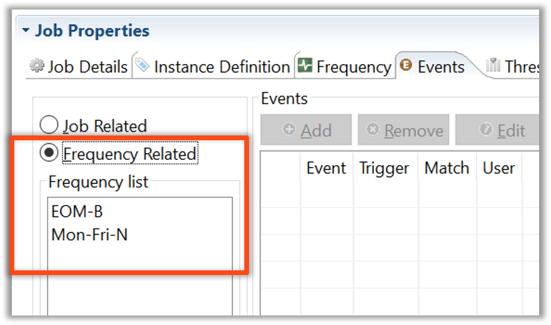

<head>
  <meta name="robots" content="noindex, nofollow" />
</head>

# Frequency Dependencies and Events

## Overview

* Each Dependency can be set to a specific Frequency:
    * Job Dependencies
    * Threshold Dependencies
    * Resource Dependencies
    * Expression Dependencies
    * Events
* The Frequency needed must be in the Active column in the Job.

## Frequency Dependencies

* Job, Threshold, and Resource Dependencies have a Frequency drop-down menu to select the Frequency to which a Dependency is tied
* If no Frequency is selected, the Dependency is tied to all Frequencies for the Job

* Frequency based Expression Dependencies have a separate activated text box if Frequency is selected

:::tip Example  

* A NULL Job runs every day of the month but requires Job 1 **when** Job 1 is built, but Job 1 only runs on Fridays 
    * An After Dependency could also be used here, but the Requires Dependency tied to a Frequency is more accurate

:::

## Frequency Events

* When creating an Event in Solution Manger, select a Frequency from the available Frequency dropdown list
* The Frequency selected must be a Frequency used to build a Job for that day
    * If there are overlapping Frequencies, the top Frequency takes precedence

## Enterprise Manager

* Each Dependency can be set to a specific Frequency:
    * Job Dependencies
    * Threshold Dependencies
    * Resource Dependencies
    * Expression Dependencies
    * Events

Example:  

* Job A runs every day of the month and requires Job 1 **when** Job 1 is built, but Job 1 only runs on the last day of the Month  
    * An After Dependency could also be used here, but the Requires Dependency tied to a Frequency is more accurate  

#### Frequency Events

* The Frequency Related radio button must be selected before an Event is created
* The Frequency selected must be a Frequency used to build a Job for that day
    * If there are overlapping Frequencies, the top Frequency takes precedence

#### Frequency Dependencies

* Job, Threshold, and Resource Dependencies have a Frequency drop-down menu to select the Frequency to which a Dependency is tied
* If no Frequency is selected, the Dependency is tied to all Frequencies for the Job

   

* Frequency based Expression Dependencies have a separate activated text box if Frequency is selected

