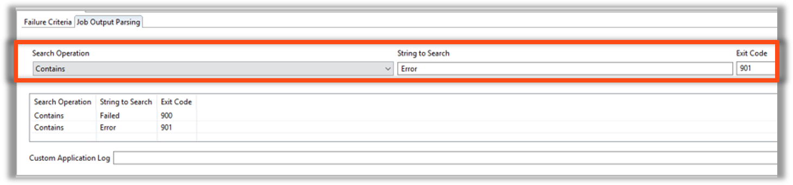
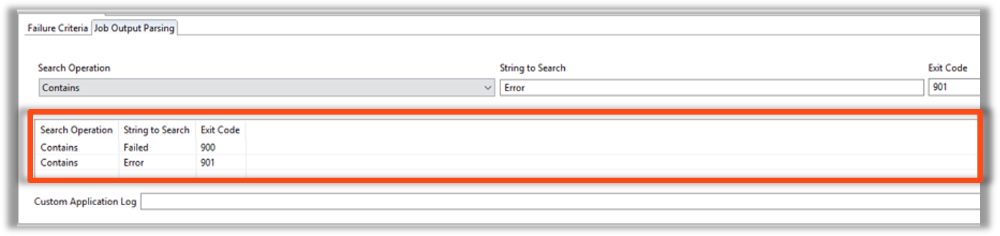
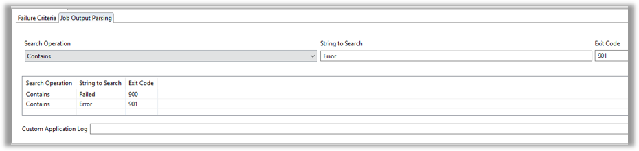

<head>
  <meta name="robots" content="noindex, nofollow" />
</head>

# Job Output Parsing

## Purpose

* Job Output Parsing
  * Prompts OpCon to scan the **Job Output** upon completion and change an Exit Code to a specified **Exit Code** if the specified **String** is found
  * Can also scan third party log files for specified **Strings**

## Components

  

* Search Operator
  * Contains
  * Does Not Contain
* String to Search
* Exit Code
* Custom Application Log
  * such as WS_FTP Pro

## Results 

* Both **Error** and **Failed** can be found in the Job Output but only one Exit Code can be passed
* Job Output Parsing Order
  * Top String's Exit Code
  * 2nd String's Exit Code
  * Etc.
  * Actual Job Output if no Error Messages were found

### Custom Application Log

* Some Applications do not write to the Job Output and instead write to their own Logs
* The **Custom Application Log** field can tell OpCon which Log File to read when scanning for error messages

## Enterprise Manager

  

---

#### Job Output Parsing Components

* Search Operator
    * Contains
    * Does Not Contain
* String to Search
* Exit Code
* Custom Application Log
    * WS_FTP Pro

#### Job Output Parsing Results 

* Both **Error** and **Failed** can be found in the Job Output but only one Exit Code can be passed
* Job Output Parsing Order
    * Top String's Exit Code
    * 2nd String's Exit Code
    * Etc.
    * Actual Job Output if no Error Messages were found

#### Custom Application Log

* Some Applications do not write to the Job Output and instead write to their own Logs
* The **Custom Application Log** field can tell OpCon which Log File to read when scanning for error messages

