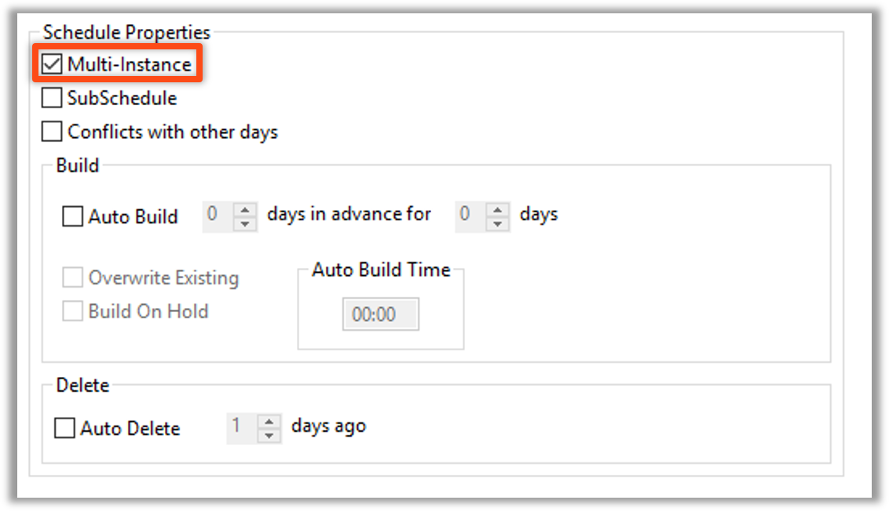

<head>
  <meta name="robots" content="noindex, nofollow" />
</head>

# Multi Instance: Overview

## Background

* Provides the ability to **manage multiple** Schedules or Jobs through a single Schedule or Job definition
  * Less Setup
  * Less Maintenance
* Marking the **Multi Instance** checkbox is the only requirement.
* Each instance of a Schedule or Job is uniquely named during build time so that multiple versions are allowed.

### Schedule Definition

### Job Definition

## Enterprise Manager

#### Multi Instance - Background 

* Provides the ability to manage multiple Schedules through a single Schedule
  * Less Setup
  * Less Maintenance
* Mark the **Multi-Instance** checkbox in Schedule Master
* Schedule Instances are defined in the **Instance Definition** tab of Schedule Master
* Each defined Instance results in a unique copy of a Schedule build for each day

 

