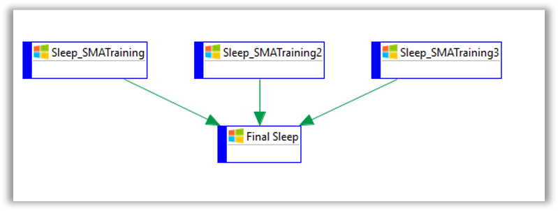

<head>
  <meta name="robots" content="noindex, nofollow" />
</head>

# Multi Instance Exercise 8

## Exercise 8: Machine Groups

### Objective

To utilize a Machine Groupe to build multiple copies of a job.

### Summary

Create a machine group called, **Advanced Training**, with three machines in it. Create a Windows job called **Machine Groups** that will build an instance of the job to run on each machine in the group.

### Instructions

#### Create the Machine Group

1.	In **Agents**, copy the **SMATraining** Machine twice. 
  * Name the Machines **SMATraining2** and **SMATraining3**.  

:::info Note

Since we do not have a matching LSAM installed for these Machines, you will never be able to successfully Start Communication.

:::

2.  In the **Agent** screen, click **Machine Groups**.
3.  In the **Machine Groups** screen, click **+ Add** 
  * In the **Name** field, enter ```Advanced Training```.
  * In the **Type** dropdown, select **Windows**.
  * Assign the **SMATraining Machines** that are in the **Revoked** column.
  * Click **Save**.

#### Create the Schedule

4.  Create a Schedule called **Machine Groups**.

#### Create the Jobs

5.  Create a **Windows** Job called, **Sleep**
  * Toggle on the **Machine Group**
  * In the **Machine Group** dropdown, select **Advanced Training**
  * Select the **Run On Each Machine** radio button.
  * In the **User Id** field, select **SMATRAINING\SMAUSER**
  * In the **Command Line** field, enter ```"C:\Multi-Instance\Accounting\Sleep.cmd" 15```
  * In the **Frequency** field, use **Example-Mon-Sun-O**
6. Create a 2nd Windows Job called, **Final Sleep**
  * In the **Primary Machine** field, select **SMATraining**
  * In the **Command Line** field, enter ```"C:\Multi-Instance\Accounting\Sleep.cmd" 15```
  * In the **Frequency** field, use **Example-Mon-Sun-O**
  * Make this job dependent on the **Sleep** Job

#### Build the Schedule

7.  Build the Schedule **On Hold**.
8.  Check the **PERT** View. 
  * The **SLEEP** Jobs should be spawned into three Jobs named **SLEEP_MACHINENAME**.


## Enterprise Manager

<details>

1.	In **Machines**, copy the SMATraining Machine twice. 
* Name the Machines **SMATraining2** and **SMATraining3**.  

:::caution Note
Since we do not have a matching LSAM installed for these Machines, you will never be able to successfully Start Communication.
:::

2.	In the Machine Groups screen, create a group called **ADVANCED TRAINING**.
3.	Select **Windows** for the Machine Type.
4.	Assign the **SMATraining Machine** as well as the two copies you made.
5.	Create a Schedule called **MACHINE GROUPS**.
6.	Create a Job with the following settings:
* **Job Name:** SLEEP
* **Machine Group:** Advanced Training
    * With **Run On Each Machine** Selected
* **Command Line:**  
```“C:\Multi-Instance\Accounting\Sleep.cmd” 15```
* **Frequency:** Create one to run every day
7.	Create a 2nd Job with the following settings:
* **Job Name:** FINAL SLEEP
* **Primary Machine:** ```SMATraining```
* **Command Line:**  
```“C:\Multi-Instance\Accounting\Sleep.cmd” 15```
* **Frequency:** Create one to run every day
* **Dependency:** Requires Dependency on the SLEEP Job
8.	Build the Schedule.
9.	Check the **PERT** View. 
* The **SLEEP** Jobs should be spawned into three Jobs named **SLEEP_MACHINENAME**.



</details>