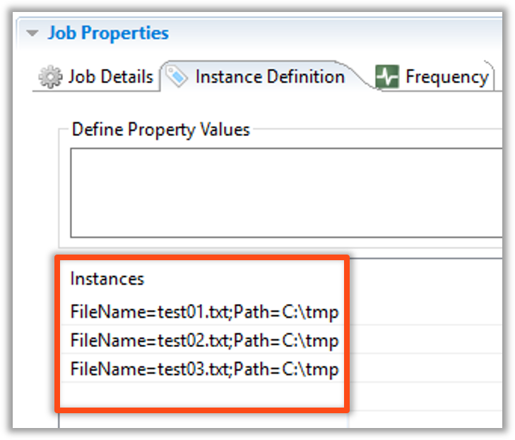

<head>
  <meta name="robots" content="noindex, nofollow" />
</head>

# Multi-Instance Jobs

## Overview

* Multi-Instance Jobs allow a single Job template to spawn multiple copies of itself using different sets of properties
* **Allow Multi-Instance** check box must be marked to allow a Multi-Instance Job 
    * Container Jobs are Multi-Instance by default

### Job Definition


## Jobs Instance Property Sets

* Create Job Instance Property Sets using the Instance Definition tab within Job Master
* Rules that apply to Multi Instance Scheudles also applly to Multi Instance Jobs
* When there are multiple properties defined in a set each property is seperated with a semi-colon (;)
  * FileName=test01.txt**;**Path=C:\tmp
* A Job will be named using the value of the first Instance Property defined in a String
  * JobName_**JI-Value**
    * JobName_**test.txt**
  * Duplicates will have a **$####**
    * JobName_test-1.txt**$0004**


## Enterprise Manager

<details>

#### Multi-Instance Jobs

* Multi-Instance Jobs allow a single Job template to spawn multiple copies of itself using different sets of properties

###### Example (Purpose):

* Ten Jobs are the same other than few small changes on the Command Line
    * Use one Job to build all ten
* **Allow Multi-Instance** check box must be marked to allow a Multi-Instance Job 
    * Container Jobs are Multi-Instance by default  


---

#### Multi-Instance Jobs - Instance Definition


* Create Job Instance Definitions using the Instance Definition tab within Job Master
* Similar rules apply to Multi-Instance Schedules and Jobs
    * Use a semicolon (;) to separate Job Instance Properties

```FileName=test01.txt;Path=C:\tmp```

* A Job will be named using the value of the first Instance Property defined in a String
* Name Scheme Example:  

```JobName_JI-Value```

```JobName_test.txt```

* Duplicates will have a **$####**

```JobName_test-1.txt$0004```



</details>