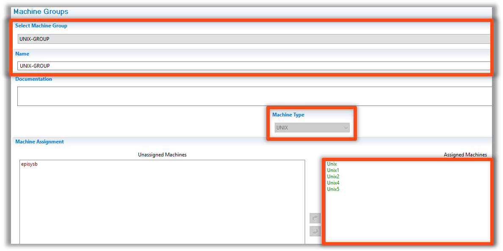
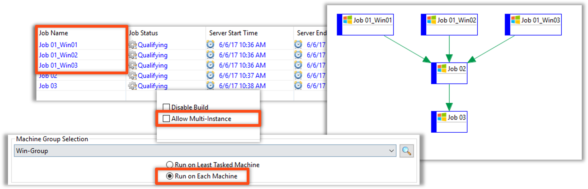

<head>
  <meta name="robots" content="noindex, nofollow" />
</head>

### Machine Groups

* Machine Groups allow Jobs to call a group of Machines instead of a specific Machine
    * A Job can run on the Least Tasked Machine
        * The Least Tasked Machine is identified based on the number of OpCon Jobs running on that Machine
* A Job can run on each Machine
    * This will spawn a copy of a Job for each Machine in a Group
    * The name of the Job will be: ```JobName_MachineName```
* A Job can act as Multi-Instance by default
* The user can quickly reassign which Machine a Job will run on

### Machine Groups - Creation

* Created under **Administration** section of Navigation Panel
* Assign Machines within the same Machine Type to a Group 


### Machine Groups - Job Master


### Machine Groups - Run on Each Machine

* This option is Multi-Instance by default
* An Instance of a Job will be created for each Machine within a Machine Group
    * Naming Scheme:
        *  ```JobName_MachineName```
            * ```Job01_Win01```
            * ```Job01_Win02```
            * ```Job01_Win03```


## Enterprise Manager

<details>

#### Machine Groups

* Machine Groups allow Jobs to call a group of Machines instead of a specific Machine
    * A Job can run on the Least Tasked Machine
        * The Least Tasked Machine is identified based on the number of OpCon Jobs running on that Machine
* A Job can run on each Machine
    * This will spawn a copy of a Job for each Machine in a Group
    * The name of the Job will be: ```JobName_MachineName```
* A Job can act as Multi-Instance by default
* The user can quickly reassign which Machine a Job will run on

#### Machine Groups - Creation

* Created under **Administration** section of Navigation Panel
* Assign Machines within the same Machine Type to a Group 



#### Machine Groups - Job Master


#### Machine Groups - Run on Each Machine

* This option is Multi-Instance by default
* An Instance of a Job will be created for each Machine within a Machine Group
    * Naming Scheme:
        *  ```JobName_MachineName```
        *  ```Job01_Win01```



</details>