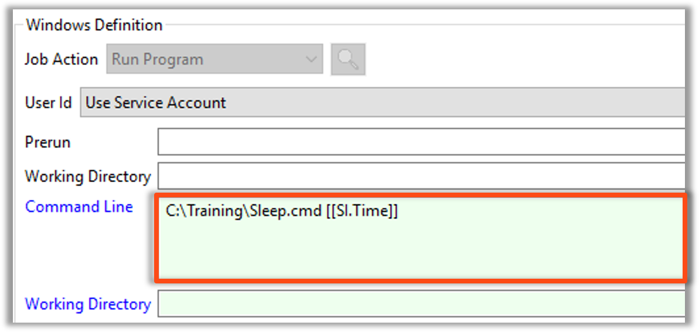

<head>
  <meta name="robots" content="noindex, nofollow" />
</head>

# Multi-Instance: Schedules

## Overview

* There are three types of Mulit Instance Schedules
  * Property Schedules
  * Machine Group Schedules
  * Named Instances Schedules 


## Property Schedules

* These are the default selection when Mult Instance is selected.
* Multiple **Property Set** are defined at the Master Schedule level
* Each containing the same set of Property Names with different Values assigned.


* Each Schedule is unquily named during the build by appending an underscore and value of the first Property defined.
  * ```ScheduleName_FirstPropertyValue```


## Utilizing Properties 

* Schedule Instance Property are called in the Command Line with ```SI.``` before the property name
  * ```[[SI.PropertyName]]```


* The Daily Schedule shows each unique Schedule Instance Property instead of a String of Properties


## Enterprise Manager

<details>

#### Multi-Instance Schedules - Instance Properties

* Each parameter line will have its own copy of the Schedule
* In this case, there are two Instance Properties defined:

```TIME=10```

```TIME=20```

* Naming Scheme: Schedule Name followed by an underscore and the first Property's value

##### Example:

```ScheduleName_FirstPropertyValue```

* ```My First Multi Instance Schedule_10```

* ```My First Multi Instance Schedule_20```


#### Calling Properties 

* Tokenization allows a Schedule Instance Property to be called in the Command Line when prefixed with ```SI.```

##### Example:

```[[SI.PropertyName]]```

```[[SI.TIME]]```

 

</details>