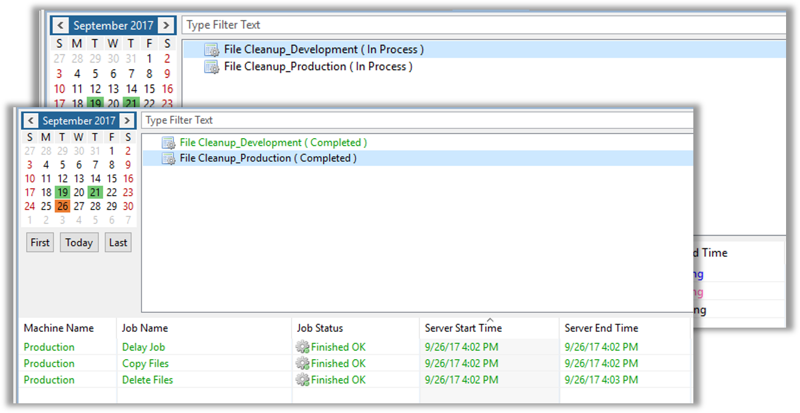

<head>
  <meta name="robots" content="noindex, nofollow" />
</head>

# Named Instance Exception Rules

* Exceptions are defined for each **Job Pattern**
* The **Exception Rules** screen varied depending on which Job Field is selected
* **Job Exception** - Is the Job Field to be altered
* Remaining Fields vary
* Drop Down Menus allow selection of replacement Option
* Text Fields allow entry of replacement value
  * Tokens are valid

## Enterprise Manager

#### Schedule Named Instances - Exception Rules

* The **Exception Rules** screen varied depending on which Job Field is selected
* **Job Field** - Field to be altered
* Remaining Fields vary
* Drop Down Menus allow selection of replacement Option
* Text Fields allow entry of replacement value
    * Tokens are valid

###### Example:

* **Schedule Name** is defined as: 
    * **ScheduleName_InstanceName**
* Notice the **Machines** used in each Schedule Instance
* **Delete Files** Job is skipped in the **Development Instance**

