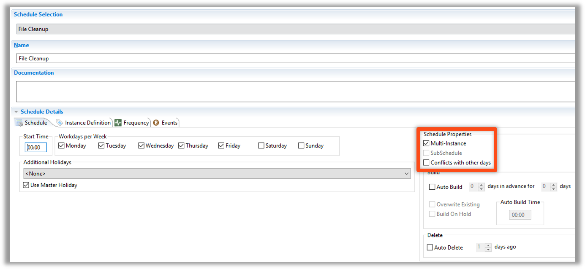

<head>
  <meta name="robots" content="noindex, nofollow" />
</head>

# Multi Instance - Named Instance Schedules

* A Schedule must be marked as **Multi-Instance** for a Named Instance feature to be enabled
* Allow for Cross-Schedule Dependecies
* Exceptions can be defined for each Multi-Instance Schedule
    * Different Machine
    * Different Start Time (or other Time setting)
    * Different Batch User
    * Different Job Build Status
    * Allows exceptions to be built for most parameters in a Schedule

:::info

* **Schedule Name** is defined as: 
  * **ScheduleName_InstanceName**

:::

## Enterprise Manager

#### Schedule Named Instances

* Cross-Schedule Dependecies
* Exceptions in each Instance of Multi-Instance Schedule
    * Different Machine
    * Different Start Time (or other Time setting)
    * Different Batch User
    * Different Job Build Status
    * Allows exceptions to be built for most parameters in a Schedule

* A Schedule must be marked as **Multi-Instance** for a Named Instance feature to be enabled

