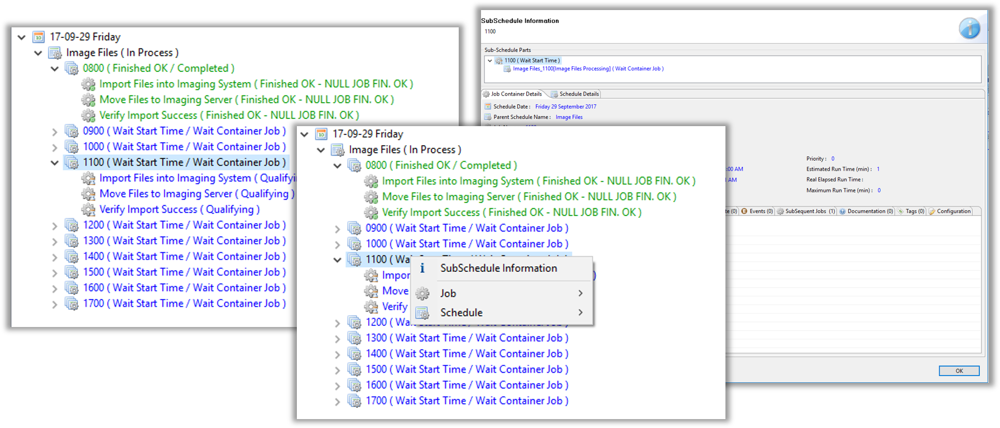
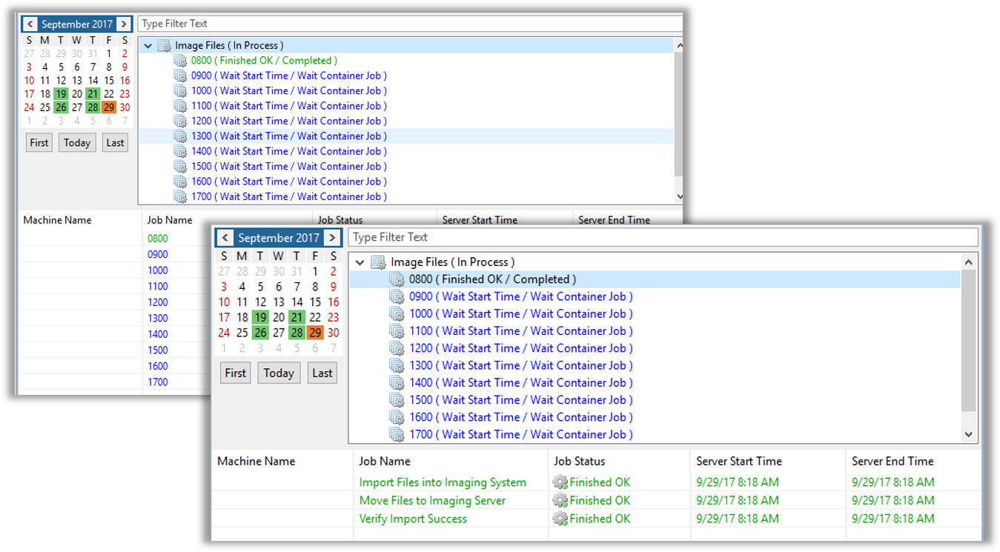

<head>
  <meta name="robots" content="noindex, nofollow" />
</head>

### SubSchedules - Schedule Instance Property

* **Schedule Instance Properties** can be used by Jobs within a **SubSchedule**
* A Container Job's **Job Instance Properties** are passed to **SubSchedules** during build time


#### SubSchedules - Operations List


### SubSchedules - Container Jobs Fully-Qualified Naming Scheme

* Typical Naming Scheme
```PrimarySchedule_ContainerJob_ContainerJobInstanceProperty[SubScheduleName]```  
* Instance Properties for the Primary Schedule and/or SubSchedule can also be included in the fully-qualified Name
* Only the first Instance Property for each component are included in the Name


### SubSchedules - Multiple Levels Deep


:::info Example

```PrimarySchedule_ContainerJob_ContainerJobInstanceProperty[SubScheduleNamed]```
```_ContainerJob2_ContainerJob2InstanceProperty[SubScheduleName2]```

:::

### SubSchedules - Background

* Purpose:
    * Give Job, Threshold, and Resource Dependencies to full Schedules
    * Embed Schedules within other Schedules for organizational purposes


* Setup:
    * Mark the SubSchedule checkbox in Schedule Master screen
    * Create a Container Job to hold the SubSchedule
* SubSchedules are Multi-Instance by default


### SubSchedules - Container Jobs

* SubSchedules are controlled via Container Jobs
* Two Parameters:
    * Job Type: Container
    * Schedule to run as SubSchedule


### SubSchedules - Schedule Instance Property Update

```$PROPERTY:ADD,PropertyName,Value```

* For a Schedule Instance Property:

```$PROPERTY:ADD,SI."PropertyName".Date."ScheduleName",Value```

```
$PROPERTY:ADD,SI."PropertyName".[[$DATE]]."PrimarySchedule_ContainerJob_ContainerJobInstanceProperty[SubScheduleName]_ContainerJob2_ContainerJob2Instance[SubSchedule2Name]",Value
```

### SubSchedules - Cross SubSchedule Events

```
$JOB:SKIP,CURRENT,PrimarySchedule_ContainerJob_ContainerJobInstanceProperty[SubScheduleName]_ContainerJob2_ContainerJob2InstanceProperty[SubSchedule2Name],Upload File
```

### Enterprise Manager

<details>

#### SubSchedules - Schedule Instance Property

* **Schedule Instance Properties** can be used by Jobs within a **SubSchedule**
* A Container Job's **Job Instance Properties** are passed to **SubSchedules** during build time  


#### SubSchedules - Operations List 



#### Subschedules - Operations Matrix  



#### SubSchedules - Container Jobs Fully-Qualified Naming Scheme

* Typical Naming Scheme
```PrimarySchedule_ContainerJob_ContainerJobInstanceProperty[SubScheduleName]```  
* Instance Properties for the Primary Schedule and/or SubSchedule can also be included in the fully-qualified Name
* Only the first Instance Property for each component are included in the Name


#### SubSchedules - Multiple Levels Deep

```
PrimarySchedule_ContainerJob_ContainerJobInstanceProperty[SubScheduleNamed]_ContainerJob2_ContainerJob2InstanceProperty[SubScheduleName2]
```  


#### SubSchedules - Background

* Purpose:
    * Give Job, Threshold, and Resource Dependencies to full Schedules
    * Embed Schedules within other Schedules for organizational purposes
* Setup:
    * Mark the SubSchedule checkbox in Schedule Master screen
    * Create a Container Job to hold the SubSchedule
* SubSchedules are Multi-Instance by default


#### SubSchedules - Container Jobs

* SubSchedules are controlled via Container Jobs
* Two Parameters:
    * Job Type: Container
    * Schedule to run as SubSchedule


#### SubSchedules - Schedule Instance Property Update

```$PROPERTY:ADD,PropertyName,Value```

* For a Schedule Instance Property:

```$PROPERTY:ADD,SI."PropertyName".Date."ScheduleName",Value```

```
$PROPERTY:ADD,SI."PropertyName".[[$DATE]]."PrimarySchedule_ContainerJob_ContainerJobInstanceProperty[SubScheduleName]_ContainerJob2_ContainerJob2Instance[SubSchedule2Name]",Value
```

#### SubSchedules - Cross SubSchedule Events

```
$JOB:SKIP,CURRENT,PrimarySchedule_ContainerJob_ContainerJobInstanceProperty[SubScheduleName]_ContainerJob2_ContainerJob2InstanceProperty[SubSchedule2Name],Upload File
```

</details>